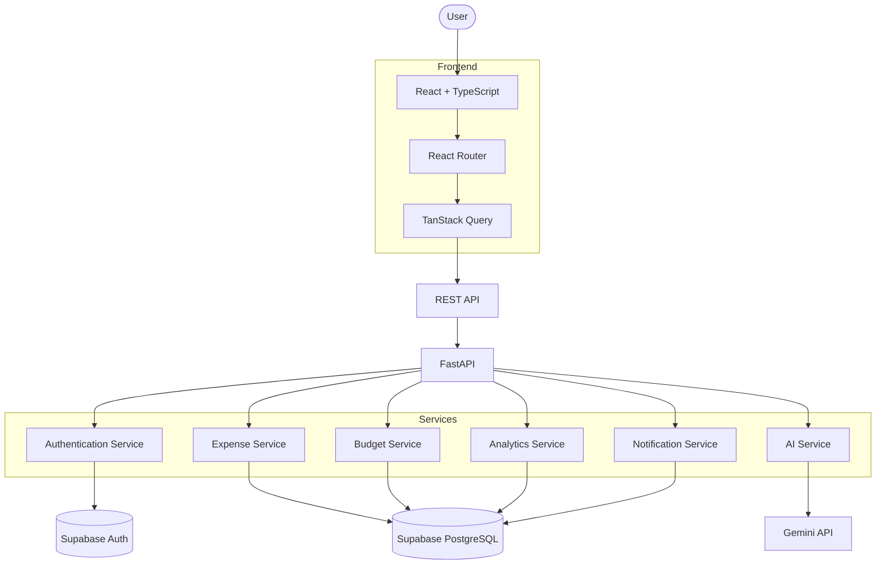
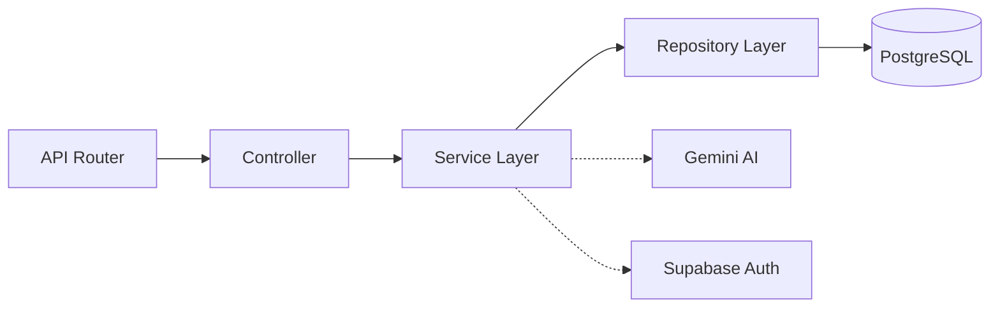
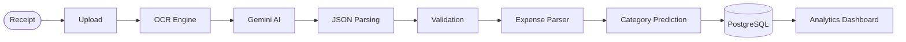
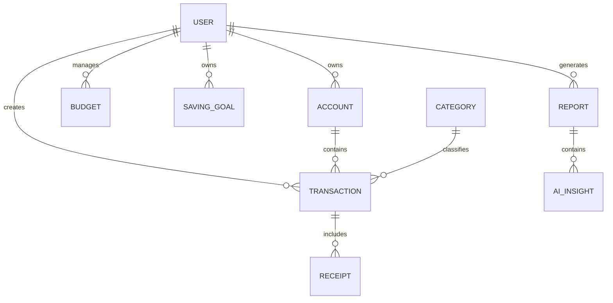

<div align="center">


# 💸 FinPilot AI

### FinPilot AI — AI-Powered Personal Finance Platform

**FinPilot AI** is a production-ready Full Stack SaaS application built with React, FastAPI, PostgreSQL, and Gemini AI.

<br />

[](https://finpilot-ai.vercel.app)
[](https://github.com/shivamshashank/finpilot-ai)
[](#)

<br />

[](https://github.com/shivamshashank/finpilot-ai/actions/workflows/ci.yml)
[](https://github.com/shivamshashank/finpilot-ai/actions/workflows/release.yml)
[](https://codecov.io/gh/shivamshashank/finpilot-ai)
[](https://goreportcard.com/report/github.com/shivamshashank/finpilot-ai)
[](https://github.com/shivamshashank/finpilot-ai/releases)
[](https://github.com/shivamshashank/finpilot-ai/stargazers)
[](https://github.com/shivamshashank/finpilot-ai/network/members)
[](LICENSE)

<br />


<br />

[Live Demo](#-live-demo) • [Features](#-features) • [System Architecture](#-system-architecture) • [Database Design](#-database-design) • [API Documentation](#-api-documentation) • [Local Development](#-local-development) • [Testing](#-testing) • [Security](#-security-practices)

</div>


---

## 📑 Table of Contents

- [Overview](#-overview)
- [Live Demo](#-live-demo)
- [Features](#-features)
- [System Architecture](#-system-architecture)
- [Database Design](#-database-design)
- [API Documentation](#-api-documentation)
- [Local Development](#-local-development)
- [Testing](#-testing)
- [Deployment & Monitoring](#-deployment--monitoring)
- [Security](#-security-practices)
- [Engineering Decisions](#-engineering-decisions)
- [Future Enhancements](#-future-enhancements)
- [Contributing](#-contributing)
- [License](#-license)

---

## 🌟 Overview

FinPilot AI is a production-ready **AI-powered Personal Finance Platform** that helps users understand, manage, and optimize their financial health through intelligent automation and modern software engineering.

Rather than functioning as a traditional expense tracker, FinPilot AI combines **Artificial Intelligence**, **real-time analytics**, and **financial planning** into a single SaaS platform. Users can:

- 📊 Visualize spending habits
- 🤖 Receive AI-powered financial insights
- 📷 Scan receipts using AI
- 💰 Track expenses and income
- 🎯 Manage budgets and savings goals
- 📈 Monitor long-term financial growth
- 💬 Interact with an AI financial assistant

**Why it's different:** most trackers stop at recording transactions. FinPilot AI layers generative AI and analytics on top to turn raw data into actionable recommendations — smart categorization, anomaly detection, budget optimization, and a conversational assistant, all built on a production-grade, tested, and monitored architecture.

---

## 🖥 Live Demo

| Service | URL |
|---|---|
| 🌐 Frontend | https://finpilot-ai.vercel.app |
| 📘 API Docs (Swagger) | https://api.finpilot-ai.com/docs |
| 📙 API Docs (ReDoc) | https://api.finpilot-ai.com/redoc |

---

## 🚀 Features

### 💰 Expense Management
Create, edit, delete, search, and filter expenses with categories, merchant tracking, tags, notes, attached receipts, favorites, and bulk operations.

### 💵 Income Management
Track multiple sources — salary, freelancing, investments, rental, and business income — with monthly overviews, trends, and source breakdowns.

### 🎯 Budget Management
Monthly and per-category budgets with smart alerts, overspending warnings, remaining-budget tracking, and AI-generated recommendations.

### 🏦 Savings Goals
Goals like an emergency fund, vacation, car, house, or education, with progress tracking, timelines, and AI-suggested monthly contributions.

### 🤖 AI Financial Assistant
A conversational assistant (powered by Gemini) that answers natural-language questions such as *"Where did I spend the most this month?"* or *"How can I reduce my food expenses?"* — producing financial summaries, spending insights, and budget/savings recommendations.

### 📷 AI Receipt Scanner
Upload a receipt and it flows through:

```
Receipt → OCR → Gemini → JSON Validation → Expense Extraction → Category Prediction → Database → Dashboard
```

Automatically extracts merchant, date, amount, currency, tax, category, and line items.

### 📊 AI Insights & Analytics Dashboard
Spending trends, monthly comparisons, budget predictions, a financial health score, category analysis, recurring/subscription detection, and anomaly flags — visualized with line, bar, pie, area, and stacked charts across widgets like Monthly Spending, Income vs. Expense, Budget Utilization, and Cash Flow.

### 🔔 Notifications
Alerts for budget overruns, monthly report availability, bill/subscription reminders, savings milestones, and AI recommendations.

### 👤 User Management & Experience
Secure per-user workspace with profile management, avatar upload, theme preferences, password reset, Google sign-in, email verification, and multi-device sessions — delivered through a responsive, accessible, dark/light-mode UI with loading skeletons, toasts, and optimistic updates.

---

## 🏗 System Architecture

FinPilot AI follows a modular, service-oriented architecture with clear separation of concerns across independent layers communicating over REST APIs.



**Backend layers** (Clean Architecture-inspired):



| Layer | Responsibility |
|---|---|
| Router | Endpoint registration, request parsing |
| Controller | Validation, DTO mapping, response formatting |
| Service | Business logic, AI integration, financial calculations |
| Repository | SQL queries, transactions, CRUD, pagination |
| Database | Persistent storage, indexes, constraints |

**AI processing pipeline:**



**Repository structure**

```text
finpilot-ai/
├── 📁 frontend/
│   └── 📁 src/
│       ├── 📁 components/     # Reusable UI components
│       ├── 📁 contexts/       # React contexts for state management
│       ├── 📁 hooks/          # Custom React hooks
│       ├── 📁 layouts/        # Page layouts
│       ├── 📁 pages/          # View/page components
│       ├── 📁 routes/         # Application routing definitions
│       ├── 📁 services/       # API integration services
│       ├── 📁 store/          # Global state store
│       ├── 📁 utils/          # Frontend utility functions
│       └── 📁 tests/          # Component & integration tests
├── 📁 backend/
│   └── 📁 app/
│       ├── 📁 api/            # API endpoints & routers
│       ├── 📁 core/           # Security, config & credentials
│       ├── 📁 database/       # DB session & connection setup
│       ├── 📁 middleware/     # CORS, logging & custom middleware
│       ├── 📁 models/         # SQLAlchemy DB models
│       ├── 📁 repositories/   # Repository layer for DB queries
│       ├── 📁 schemas/        # Pydantic schemas for data validation
│       ├── 📁 services/       # Business logic & AI/OCR engines
│       ├── 📁 utils/          # Backend utility functions
│       └── 📁 tests/          # PyTest unit & integration tests
├── 📁 docs/                   # System & API documentation
└── 📄 docker-compose.yml      # Local development compose configuration
```

---

## 🗄 Database Design



| Table | Key Fields |
|---|---|
| User | id, name, email, avatar, created_at |
| Transaction | id, user_id, amount, category_id, merchant, currency, notes, created_at |
| Budget | id, user_id, category, monthly_limit, spent, remaining |
| SavingGoal | id, title, target_amount, saved_amount, target_date |
| AIInsight | id, report_id, recommendation, confidence_score |

**Provider:** Supabase PostgreSQL · **ORM:** SQLAlchemy · **Migrations:** Alembic

```bash
alembic revision --autogenerate   # generate migration
alembic upgrade head              # apply migration
```

---

## 🔌 API Documentation

**Base URL:** `http://localhost:8000/api/v1` (dev) · `https://api.finpilot.ai/api/v1` (prod)
**Docs:** `/docs` (Swagger) · `/redoc` (ReDoc) · `/openapi.json`

```text
/api/v1
├── 🔐 auth/            # User registration, login, JWT & OAuth sessions
├── 👤 users/           # Profile details, preference settings
├── 💸 expenses/        # Record, update, search & paginate expenses
├── 💰 income/          # Track monthly/one-off income streams
├── 📊 budgets/         # Define and monitor category limits
├── 🎯 goals/           # Savings goals, progress and targets
├── 📈 analytics/       # Fetch monthly summaries & spending trends
├── 🤖 ai/              # Receipt scanning OCR & chat insights
├── 📋 reports/         # PDF export & comprehensive financial audits
├── 🔔 notifications/   # Custom alert and threshold notifications
└── ⚙️ settings/        # System and notification configurations
```

### Authentication
```http
POST /auth/register
POST /auth/login
POST /auth/google
POST /auth/logout
```

### Expenses
```http
POST   /expenses
GET    /expenses?page=1&limit=20&category=Food
PUT    /expenses/{expenseId}
DELETE /expenses/{expenseId}
```

### Income
```http
GET /income          POST /income
PUT /income/{id}      DELETE /income/{id}
```

### Analytics
```http
GET /analytics
```
Returns monthly spending, income, savings, cash flow, trends, and category breakdown.

### AI
```http
POST /ai/chat         # { "message": "How much did I spend on food this month?" }
POST /ai/receipt      # image/PDF upload
POST /ai/insights     # monthly report, spending analysis, savings suggestions
```

Example receipt-scan response:
```json
{
  "merchant": "Starbucks",
  "amount": 15.75,
  "category": "Food",
  "currency": "GBP"
}
```

### Reports
```http
GET /reports
GET /reports/monthly
GET /reports/annual
GET /reports/export   # CSV or PDF
```

---

## 👨‍💻 Local Development

**Prerequisites:** Node.js ≥ 22, Python ≥ 3.13, Docker Desktop (optional), Git

```bash
git clone https://github.com/shivamshashank/finpilot-ai.git
cd finpilot-ai
```

### Backend
```bash
cd backend
python -m venv .venv
source .venv/bin/activate        # Windows: .venv\Scripts\activate
pip install -r requirements.txt
uvicorn app.main:app --reload    # http://localhost:8000
```

### Frontend
```bash
cd frontend
npm install
npm run dev                      # http://localhost:5173
```

### Docker (full stack)
```bash
docker compose up --build
docker compose logs
docker compose down
```

### Environment Variables

```env
# backend/.env
DATABASE_URL=
SUPABASE_URL=
SUPABASE_ANON_KEY=
SUPABASE_SERVICE_ROLE_KEY=
GEMINI_API_KEY=
JWT_SECRET=
JWT_ALGORITHM=
ACCESS_TOKEN_EXPIRE_MINUTES=

# frontend/.env
VITE_API_URL=
VITE_SUPABASE_URL=
VITE_SUPABASE_ANON_KEY=
```

**Authentication:** Supabase Auth, supporting Email/Password and Google OAuth, with JWT sessions and RBAC authorization.

---

## 🧪 Testing

```bash
pytest -v --cov=app        # backend unit + integration tests
npm run test:coverage      # frontend component tests
npx playwright test --ui   # end-to-end tests
```

**Testing pyramid:**

```mermaid
graph TD
    Top[▲ End-to-End] --> Middle[Integration Tests]
    Middle --> Bottom[Unit Tests]

    Top --- TopLabels["Login · Registration · Expense CRUD"]
    Middle --- MiddleLabels["REST APIs · Database · Auth · Analytics"]
    Bottom --- BottomLabels["Components · Utils · Services · AI Helpers"]
                 ▼
```

| Test Type | Target Coverage |
|---|---|
| Unit Tests | 90%+ |
| Integration Tests | Critical APIs |
| End-to-End | Core user flows |

**Code quality:**
```bash
ruff check . && black .            # backend
npm run lint && npm run format     # frontend
```
Pre-commit hooks (Husky) run lint, formatting, unit tests, and type checking automatically.

---

## 🚀 Deployment & Monitoring

| Layer | Provider |
|---|---|
| Frontend Hosting | Vercel |
| Backend Hosting | Railway |
| Database & Auth | Supabase |
| AI | Gemini API |
| Error Monitoring | Sentry |
| Product Analytics | PostHog |
| CI/CD | GitHub Actions |

**Pipeline:** every push runs `Install → Lint → Unit Tests → Integration Tests → Build → Docker Build → Deploy → Health Checks → Production`.

**Health endpoints:**
```http
GET /health
GET /ready
GET /live
```

**Observability:** API latency, error rate, active users, AI response time, database query performance, and request throughput are tracked via Sentry and PostHog.

---

## 🔐 Security Practices

- **Auth:** OAuth 2.0, JWT sessions, protected routes, RBAC
- **API:** rate limiting, input validation/sanitization, HTTPS, CORS
- **Database:** Row Level Security, parameterized queries, least-privilege access
- **Frontend:** CSP headers, XSS/CSRF protection
- **Secrets:** managed via GitHub Secrets, Railway Variables, and Vercel Environment Variables — never committed to Git
- **Backups:** daily database backups with point-in-time recovery; storage object versioning

Found a vulnerability? **Do not open a public issue** — email **shivamkumar872000@gmail.com** with a description, reproduction steps, and impact.

---

## ⚡ Engineering Decisions

| Choice | Why |
|---|---|
| **React + TypeScript** | Mature ecosystem, strong typing, excellent DX, huge industry adoption |
| **FastAPI** | Async-first, automatic OpenAPI docs, native Pydantic validation, simple DI |
| **PostgreSQL (via Supabase)** | ACID compliance and strong relational modeling for financial data, plus built-in auth/storage |
| **Gemini** | Abstracted behind a service layer so the AI provider can be swapped without touching business logic |
| **TanStack Query** | Server-state caching, background refetching, optimistic updates |
| **Layered backend** (`Controller → Service → Repository`) | Testability, maintainability, clean separation of concerns |

**Scalability roadmap:** Redis caching, Celery/RabbitMQ or Kafka for async processing, an API Gateway, and Kubernetes for future horizontal scaling.

---

## 🔮 Future Enhancements

**AI:** financial coach, voice assistant, predictive spending, investment suggestions, tax estimation
**Finance:** multi-currency support, open banking integration, crypto/investment portfolio tracking, subscription tracking
**Platform:** mobile apps (React Native), offline mode, desktop app, multi-tenant/team expense management

---

## 🤝 Contributing

1. Fork the repository
2. Create a feature branch
3. Commit using [Conventional Commits](https://www.conventionalcommits.org/) (`feat:`, `fix:`, `docs:`, `refactor:`, `test:`)
4. Ensure lint, formatting, and tests all pass
5. Open a Pull Request

Coding standards: PEP 8 & Google Python Style Guide (backend), TypeScript ESLint rules (frontend), Semantic Versioning.

---

## 📄 License

Licensed under the **MIT License** — see [LICENSE](LICENSE) for details.

---

## 👨‍💻 About the Author

**Shivam Shashank** — Software Engineer passionate about Full-Stack Development, Backend Engineering, Artificial Intelligence, Cloud Computing, and Distributed Systems.

🌐 [Portfolio](https://www.shivam-shashank.me) · 💼 [LinkedIn](https://www.linkedin.com/in/shivam-shashank-2b5766217) · 💻 [GitHub](https://github.com/shivamshashank) · 📧 shivamkumar872000@gmail.com

---

## ⭐ Support the Project

If you found this repository useful, please ⭐ star it, 🍴 fork it, 🐛 report issues, and 💡 suggest features — it genuinely helps.

<br />

<p align="center">
  <b>💸 FinPilot AI</b><br/>
  <sub>AI-Powered Personal Finance Platform</sub><br/><br/>
  Built with ❤️ using <b>React</b>, <b>FastAPI</b>, <b>Supabase</b>, <b>PostgreSQL</b>, and <b>Gemini AI</b><br/>
  © 2026 Shivam Shashank
</p>
